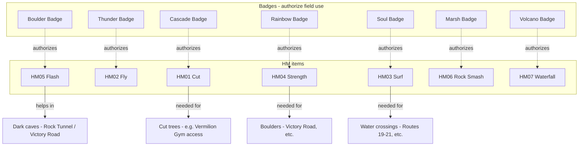
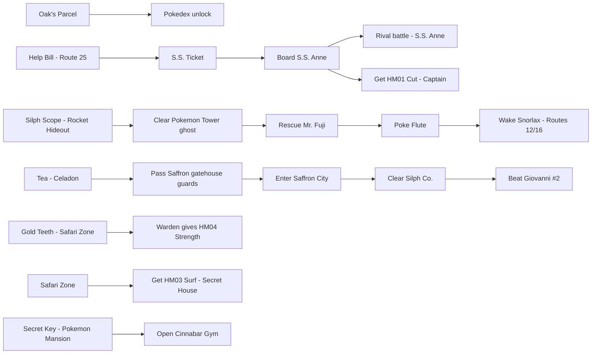
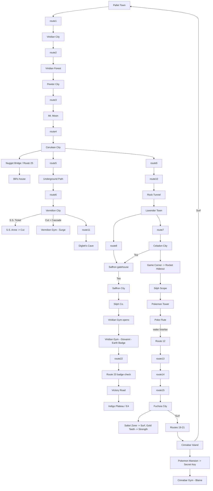
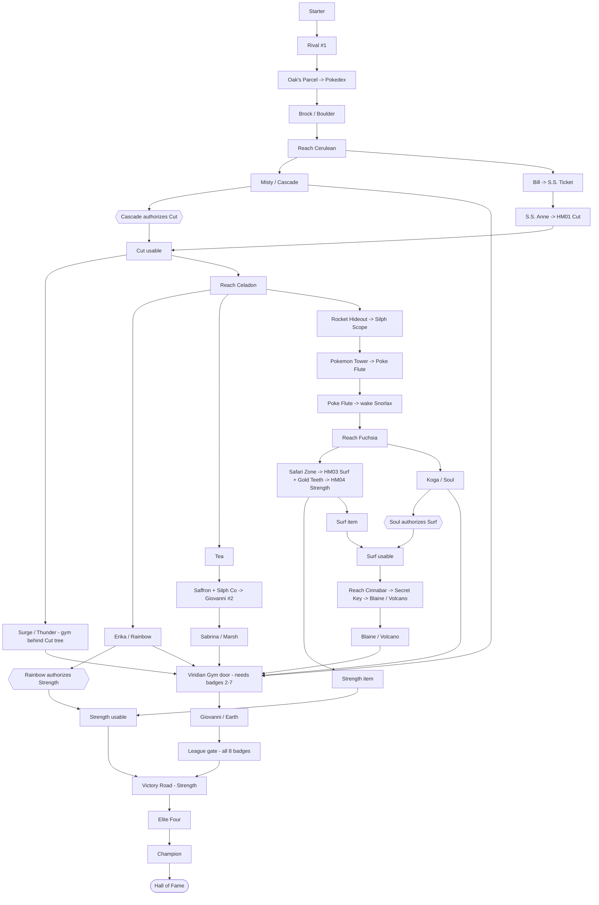

# FRLG glitchless — progression dependency graph (first-pass)

> **Status: FIRST-PASS STRUCTURAL DRAFT.** This is reasoned from general game
> *structure* (mandatory story gates, HM/badge/key-item dependencies), **not**
> from any web route. Every gate marked **⚠️verify** must still be confirmed
> against `decompiled/` (map scripts, warp tables, event flags, HM/badge field
> checks) before we trust it for routing. See the verification checklist at the
> end.
>
> **Scope:** high-level *what-gates-what*, not turn-by-turn. Nodes are
> milestones / required acquisitions; edges are hard dependencies. Where the
> game *allows* ordering freedom we say so — those are the degrees of freedom
> the router gets to optimize.
>
> **End condition** (from `docs/tas-rules.md`): beat the Elite Four **and** the
> Champion → Hall of Fame / credits.

---

## Legend

- **Solid box / arrow** = mandatory milestone and a hard prerequisite edge.
- **HM gate** = a field move whose use is gated by a **badge** (you must own
  *both* the HM and the enabling badge to traverse).
- **Key-item gate** = a specific item unlocks an area/event.
- "**(order-free)**" = the game does not force this relative to its siblings;
  it's a router degree of freedom, constrained only by the gates drawn.

---

## 1. Critical-path spine (the mandatory story line)

This is the linear backbone every glitchless completion must pass through.
Branches and HM/key-item gates are layered on in §2–§4.

> **⚠️verify (gym order) — partly resolved.** The first seven gyms are *not* a
> forced linear sequence; their real constraints are the HM/area gates in §2–§5.
> **But** the decomp pins two hard ordering facts (§5/§6): the **Viridian Gym
> door requires badges 02–07**, so **Brock-or-not aside, Misty/Surge/Erika/Koga/
> Sabrina/Blaine all precede Giovanni (Earth)**; and the **league approach
> checks all 8 badges** (Boulder at the Route 22 gate). So Giovanni/Earth is
> genuinely last, and every other gym is mandatory. Ordering freedom lives among
> gyms 1–7, bounded by the §5 gate graph.

---

## 2. HM acquisition + badge → field-use gating

Each HM needs **(a)** the HM item itself and **(b)** the badge that authorizes
its field use. Traversal that depends on an HM therefore depends on *both*.

> **✅ CONFIRMED (2026-06-22).** The badge→HM map is exact. `party_menu.c:3926`
> gates field-move use on `FlagGet(FLAG_BADGE01_GET + fieldMove)` over the
> `FIELD_MOVE_*` enum (`include/constants/party_menu.h`): Flash(0)→Boulder,
> **Cut(1)→Cascade**, Fly(2)→Thunder, **Strength(3)→Rainbow**, **Surf(4)→Soul**,
> RockSmash(5)→Marsh, Waterfall(6)→Volcano. (`field_control_avatar.c:605` also
> uses `FLAG_BADGE05_GET` for the auto-Surf prompt — consistent.)
>
> Still open: which HMs are *strictly required* to reach the E4. Confirmed
> required so far: **Cut** (Vermilion gym), **Strength** (Victory Road), **Surf**
> (Cinnabar/Blaine path). **Fly / Flash / Rock Smash / Waterfall** still look
> optional — confirm individually.

---

## 3. Key-item gates (area/event unlocks)

> **✅ CONFIRMED (2026-06-22)** — all givers/gates verified (see §6 for files):
> - **Tea** → obtained in `CeladonCity_Condominiums_1F`; checked at all **four**
>   Saffron gatehouses (Route 5 South / 6 North / 7 East / 8 West entrances).
> - **Surf (HM03)** → `SafariZone_SecretHouse`. **Strength (HM04)** → Warden
>   trades it for **Gold Teeth** (`FuchsiaCity_WardensHouse`).
> - **Silph Scope** → `RocketHideout_B4F`; hard gate for the Pokémon Tower
>   Marowak ghost (`StartMarowakBattle` checks `ITEM_SILPH_SCOPE`).
> - **Poké Flute** → Mr. Fuji in `LavenderTown_VolunteerPokemonHouse`.
> - **Secret Key** → found in `PokemonMansion_B1F`; unlocks the Cinnabar Gym
>   door (`CinnabarIsland` checks `FLAG_HIDE_POKEMON_MANSION_B1F_SECRET_KEY`).
> - **S.S. Ticket** → Bill in `Route25_SeaCottage` (no badge gate).

---

## 4. Geographic / traversal gating (which gate unlocks which region)

> **⚠️verify (traversal):**
> - Whether **Flash** is required (vs. optional) for **Rock Tunnel** and
>   **Victory Road**.
> - **Victory Road** internal requirements: confirm it needs **Strength**
>   (boulders) and whether **Surf** and/or other HMs are required inside.
> - Confirm the **Snorlax** blocks (Routes 12 *and* 16) and that at least one
>   must be cleared for the southern loop.
> - Confirm **Cut** is the hard gate for **Vermilion Gym** entry.
> - Confirm **Surf** is the only legitimate (glitchless) way Fuchsia→Cinnabar
>   and Cinnabar→Pallet.

---

## 5. Combined hard-dependency graph (the routing-relevant DAG)

This collapses §1–§4 into just the **hard gates** that constrain ordering —
this is the graph the router actually reasons over. Anything not connected here
is order-free.

> **✅ Decomp-verified (2026-06-22).** §5 gates checked against `decompiled/`.
> Citations in §6. Results:
> 1. **Cut → Surge's gym** — ✅ HM01 from `SSAnne_CaptainsOffice`; Cut gated by
>    **Cascade** (badge 02, see §2); a `EventScript_CutTree` sits in
>    `VermilionCity` blocking the gym approach.
> 2. **Silph Scope → Tower → Poké Flute → Snorlax** — ✅ `StartMarowakBattle`
>    requires `ITEM_SILPH_SCOPE`; Snorlax (Routes 12 **and** 16) requires
>    `FLAG_GOT_POKE_FLUTE`. Hard chain confirmed.
> 3. **Surf/Soul → Cinnabar; Strength via Gold Teeth/Warden** — ✅ HM03 Surf in
>    `SafariZone_SecretHouse`; Cinnabar gym door unlocks on the **Secret Key**
>    flag (`FLAG_HIDE_POKEMON_MANSION_B1F_SECRET_KEY`); Warden trades **HM04
>    Strength** for **Gold Teeth**.
> 4. **Viridian Gym (Earth)** — ⚠️ **CORRECTED.** Not a "Silph Co. flag" — the
>    door (`ViridianCity_EventScript_TryUnlockGym`) hard-requires **badges
>    02–07** (Cascade, Thunder, Rainbow, Soul, Marsh, Volcano). So **all six
>    middle gyms precede Giovanni/Earth** (graph updated). It's *indirectly*
>    after Silph only because Marsh/Sabrina needs Saffron freed.
> 5. **Victory Road HMs** — ✅ **Strength** confirmed (multiple
>    `EventScript_StrengthBoulder` on all 3 floors). **Surf inside VR not
>    found** — the old `surfok → vroad` edge was removed; Surf stays critical
>    anyway via Blaine/Cinnabar. (A water section inside VR is still worth a
>    closer look.)
> 6. **Bill / S.S. Ticket** — ✅ **Cerulean-only.** Gated solely on
>    `FLAG_HELPED_BILL_IN_SEA_COTTAGE`; **no badge check** — Cascade not required.
> 7. **Fuchsia reachability** — ✅ **Poké Flute is the hard gate.** Fuchsia's
>    only connections are Route 19 (water/Surf), 18 (Cycling Road) and 15; both
>    land approaches route through a Snorlax (Routes 12/16), and Surf (HM03) is
>    unobtainable until *inside* Fuchsia's Safari Zone. No earlier approach.
>
> **Bonus finding:** the **league approach checks all 8 badges**, split across
> two gates — **Boulder** at `Route22_NorthEntrance`, **Cascade…Earth** at
> `Route23` (sequential per-badge guards keyed by `VAR_MAP_SCENE_ROUTE23`). So
> Brock/Boulder stays mandatory even though the Viridian door doesn't check it.

---

## Verification checklist (against `decompiled/`)

- [x] Badge → HM field-use authorization map — `party_menu.c:3926`.
- [~] Which HMs are **strictly required** to reach the E4 — Cut/Strength/Surf
      confirmed required; Fly/Flash/Rock Smash/Waterfall still to disprove.
- [x] Gym entry gates — Cut tree at Vermilion; Secret Key at Cinnabar; **Viridian
      door = badges 02–07** (NOT a Silph flag — corrected).
- [x] Key-item givers & flags — S.S. Ticket (Bill), Silph Scope (Rocket Hideout
      B4F), Poké Flute (Mr. Fuji), Tea (Celadon Condominiums), Gold Teeth →
      Strength (Warden), Secret Key (Pokémon Mansion B1F), Surf (Safari Zone).
- [x] Snorlax block flags (Routes 12 & 16) → `FLAG_GOT_POKE_FLUTE`.
- [x] Saffron gatehouse guard gate (Tea) — four entrances confirmed.
- [x] League badge gate — **all 8** (Boulder @ Route 22 gate, Cascade…Earth @
      Route 23). Victory Road traversal → **Strength** (boulders); Surf-inside
      not found.
- [ ] Exact final-input endpoint at the Champion→Hall-of-Fame transition
      (from scripts, per `tas-rules.md`).
- [ ] FireRed vs LeafGreen differences in any of the above (should be none for
      structure, but confirm version-exclusive item/encounter givers).

---

## 6. Decomp source citations

All paths relative to `decompiled/`. Verified 2026-06-22.

| Gate / fact | Source |
|---|---|
| Badge→HM field-use map | `src/party_menu.c:3926` (`FLAG_BADGE01_GET + fieldMove`); enum `include/constants/party_menu.h:34-41` |
| Surf auto-prompt badge | `src/field_control_avatar.c:605` (`FLAG_BADGE05_GET`) |
| Badge flag constants | `include/constants/flags.h:1364-1372` |
| S.S. Ticket (Bill, no badge) | `data/maps/Route25_SeaCottage/scripts.inc` (`FLAG_HELPED_BILL_IN_SEA_COTTAGE`) |
| HM01 Cut giver | `data/maps/SSAnne_CaptainsOffice/scripts.inc` |
| Vermilion Cut tree | `data/maps/VermilionCity/map.json` (`EventScript_CutTree`, ~tile 19,24; gym warp 14,25) |
| Silph Scope giver | `data/maps/RocketHideout_B4F/scripts.inc` |
| Marowak ghost needs Silph Scope | `src/battle_setup.c:221,320` (`StartMarowakBattle`, `CheckSilphScopeInPokemonTower`) |
| Poké Flute giver | `data/maps/LavenderTown_VolunteerPokemonHouse/scripts.inc` |
| Snorlax needs Poké Flute | `data/maps/Route12/scripts.inc:16`, `data/maps/Route16/scripts.inc:34` |
| HM03 Surf giver | `data/maps/SafariZone_SecretHouse/scripts.inc` |
| Gold Teeth → HM04 Strength | `data/maps/FuchsiaCity_WardensHouse/scripts.inc:7,26` |
| Secret Key → Cinnabar gym | `data/maps/CinnabarIsland/scripts.inc:40-44` (`FLAG_HIDE_POKEMON_MANSION_B1F_SECRET_KEY`); item in `data/maps/PokemonMansion_B1F/map.json` |
| Viridian door = badges 02–07 | `data/maps/ViridianCity/scripts.inc:29-39` (`TryUnlockGym`) |
| Giovanni/Earth = badge 08 | `data/maps/ViridianCity_Gym/scripts.inc:20` |
| Tea gate (4 gatehouses) | `data/maps/Route{5_South,6_North,7_East,8_West}Entrance/scripts.inc`; Tea from `data/maps/CeladonCity_Condominiums_1F/scripts.inc` |
| Victory Road Strength boulders | `data/maps/VictoryRoad_{1F,2F,3F}/map.json` (`EventScript_StrengthBoulder`) |
| League badge gates (all 8) | Boulder: `data/maps/Route22_NorthEntrance/scripts.inc:4`; Cascade…Earth: `data/maps/Route23/scripts.inc`; logic `data/scripts/route23.inc:46-77` |
| Fuchsia connections | `data/maps/FuchsiaCity/map.json` (Route 19 down / 18 left / 15 right) |
