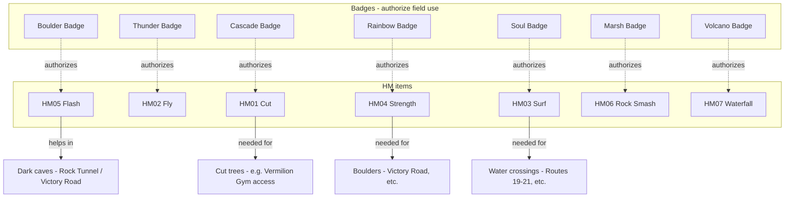
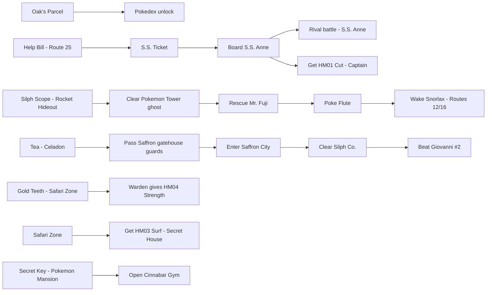
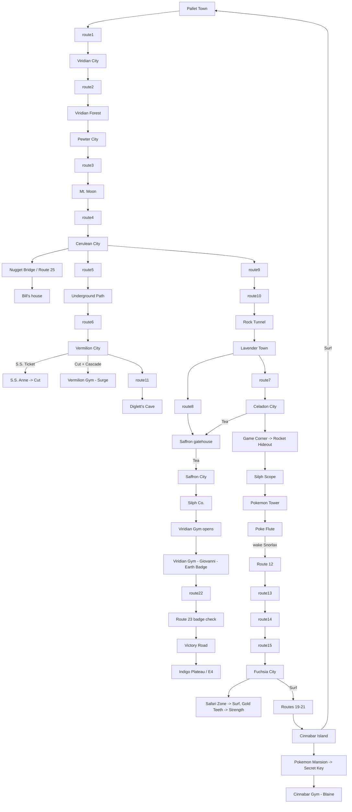
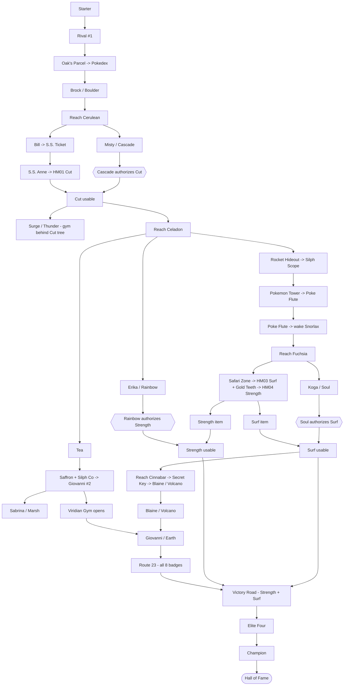

# FRLG glitchless — progression dependency graph (first-pass)

> **Status: FIRST-PASS STRUCTURAL DRAFT.** This is reasoned from general game
> *structure* (mandatory story gates, HM/badge/key-item dependencies), **not**
> from any web route. Every gate marked **⚠️verify** must still be confirmed
> against `decompiled/` (map scripts, warp tables, event flags, HM/badge field
> checks) before we trust it for routing. See the verification checklist at the
> end.
>
> **Scope:** high-level *what-gates-what*, not turn-by-turn. Nodes are
> milestones / required acquisitions; edges are hard dependencies. Where the
> game *allows* ordering freedom we say so — those are the degrees of freedom
> the router gets to optimize.
>
> **End condition** (from `docs/tas-rules.md`): beat the Elite Four **and** the
> Champion → Hall of Fame / credits.

---

## Legend

- **Solid box / arrow** = mandatory milestone and a hard prerequisite edge.
- **HM gate** = a field move whose use is gated by a **badge** (you must own
  *both* the HM and the enabling badge to traverse).
- **Key-item gate** = a specific item unlocks an area/event.
- "**(order-free)**" = the game does not force this relative to its siblings;
  it's a router degree of freedom, constrained only by the gates drawn.

---

## 1. Critical-path spine (the mandatory story line)

This is the linear backbone every glitchless completion must pass through.
Branches and HM/key-item gates are layered on in §2–§4.

> **⚠️verify (gym order):** The gym *badge* numbers above are the conventional
> order, but FRLG does **not** strictly force all of them in this sequence — the
> real constraints are the **HM/area gates** in §2–§4, plus the Earth-Badge gym
> opening only after a mid-game event (Silph Co). The router's true ordering
> freedom is whatever those gates leave open. Treat this column as illustrative
> until the gate graph (§5) is decomp-confirmed.

---

## 2. HM acquisition + badge → field-use gating

Each HM needs **(a)** the HM item itself and **(b)** the badge that authorizes
its field use. Traversal that depends on an HM therefore depends on *both*.

> **⚠️verify (badge↔HM map):** the badge→HM authorization pairs above are the
> standard FRLG mapping but MUST be confirmed against the decomp's field-use
> badge checks (look for the per-HM `BADGE0x_GET` / `FLAG_BADGE0x_GET` checks in
> the field-move scripts). **Fly/Flash/Rock Smash/Waterfall are likely
> *optional*** for a glitchless completion (convenience, not gating) — confirm
> which HMs are *strictly required* to reach the E4 vs. merely useful.

---

## 3. Key-item gates (area/event unlocks)

> **⚠️verify (FRLG-specific items & givers):**
> - **Tea** is an FRLG-only gate for the Saffron guards (replaces RBY drinks) —
>   confirm the item id, where it's obtained, and which gatehouses it opens.
> - Confirm **Surf** location (Safari Zone Secret House) and that **Strength**
>   comes from the **Warden** in exchange for **Gold Teeth**.
> - Confirm **Silph Scope** comes from Giovanni at the Game Corner Rocket
>   Hideout, and is the hard gate for Pokémon Tower.
> - Confirm **Secret Key** (Pokémon Mansion) gates the Cinnabar Gym door.

---

## 4. Geographic / traversal gating (which gate unlocks which region)

> **⚠️verify (traversal):**
> - Whether **Flash** is required (vs. optional) for **Rock Tunnel** and
>   **Victory Road**.
> - **Victory Road** internal requirements: confirm it needs **Strength**
>   (boulders) and whether **Surf** and/or other HMs are required inside.
> - Confirm the **Snorlax** blocks (Routes 12 *and* 16) and that at least one
>   must be cleared for the southern loop.
> - Confirm **Cut** is the hard gate for **Vermilion Gym** entry.
> - Confirm **Surf** is the only legitimate (glitchless) way Fuchsia→Cinnabar
>   and Cinnabar→Pallet.

---

## 5. Combined hard-dependency graph (the routing-relevant DAG)

This collapses §1–§4 into just the **hard gates** that constrain ordering —
this is the graph the router actually reasons over. Anything not connected here
is order-free.

> **⚠️verify (the whole DAG):** §5 is the highest-value artifact and the most
> assumption-laden. The key claims to confirm from decomp:
> 1. **Cut** (HM01 from S.S. Anne) + **Cascade** is the gate to **Surge's gym**.
> 2. **Silph Scope** → Pokémon Tower → **Poké Flute** → Snorlax is a hard chain
>    on the way south to Fuchsia.
> 3. **Surf** (Safari Zone) + **Soul** is the gate to **Cinnabar**, and
>    **Strength** (Warden, via Gold Teeth) + **Rainbow** is a Victory Road gate.
> 4. **Viridian Gym (Giovanni / Earth)** only opens **after Silph Co.**
> 5. Victory Road's real internal HM requirements.
> 6. **Bill / S.S. Ticket** prerequisite: is it truly just "reach Cerulean," or
>    is **Cascade** (Misty) actually required? Drawn here as Cerulean-only.
> 7. **Fuchsia reachability** — is it gated *solely* by Poké Flute → Snorlax, or
>    is there an **earlier** legitimate (glitchless) approach (e.g. via Surf, or
>    a southern route) that would let Fuchsia/Koga/Safari happen sooner? If so,
>    the `flute → fuchsia` edge is too strict and should be loosened.

---

## Verification checklist (next pass against `decompiled/`)

- [ ] Badge → HM field-use authorization map (field-move scripts / badge flags).
- [ ] Which HMs are **strictly required** to reach the E4 vs. optional.
- [ ] Gym entry gates (Cut tree at Vermilion Gym; Secret Key at Cinnabar Gym;
      Viridian Gym open-flag tied to Silph Co.).
- [ ] Key-item givers & flags: S.S. Ticket (Bill), Silph Scope (Rocket Hideout),
      Poké Flute (Mr. Fuji), Tea (Celadon), Gold Teeth → Strength (Warden),
      Secret Key (Pokémon Mansion), Surf (Safari Zone).
- [ ] Snorlax block flags (Routes 12 & 16) and Poké Flute dependency.
- [ ] Saffron gatehouse guard gate (Tea) — FRLG-specific, confirm item + scripts.
- [ ] Route 23 badge-check count and Victory Road traversal HMs.
- [ ] Exact final-input endpoint at the Champion→Hall-of-Fame transition
      (from scripts, per `tas-rules.md`).
- [ ] FireRed vs LeafGreen differences in any of the above (should be none for
      structure, but confirm version-exclusive item/encounter givers).
